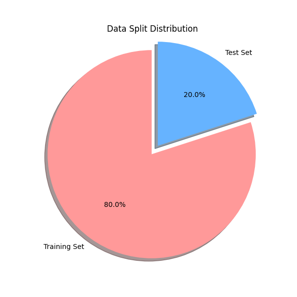
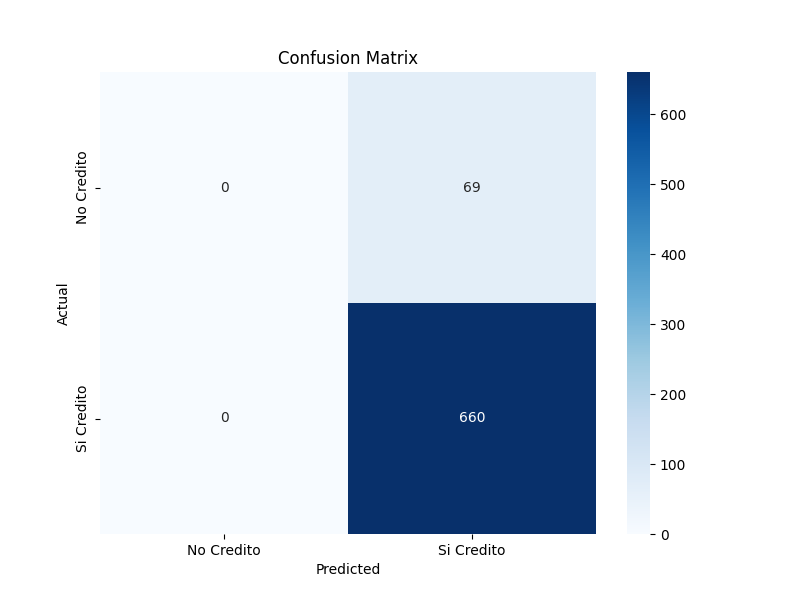

# Reporte de Entrenamiento y Evaluación del Modelo de Crédito

Este reporte detalla el proceso de creación, entrenamiento y evaluación de un modelo de clasificación `XGBoostClassifier` para predecir la aprobación de créditos agrícolas.

## 1. Estructura del Proyecto

El proyecto se organiza de la siguiente manera:

```
.
├── data/
│   ├── entrenamientos_datos_credito_train_ready.csv  # Dataset original
│   └── datos_inventados_evaluacion.csv               # Dataset sintético generado para evaluación
├── models/
│   └── modelo_xgboost_credito.pkl                    # Modelo entrenado serializado (Pipeline)
├── results/
│   ├── distribution_split.png                        # Gráfico de distribución de datos
│   ├── confusion_matrix.png                          # Matriz de confusión
│   ├── metrics.txt                                   # Métricas de rendimiento detalladas
│   └── evaluacion_datos_inventados.csv               # Tabla de predicciones sobre datos inventados
├── src/
│   ├── entrenar_modelo.py                            # Script de entrenamiento
│   └── evaluar_modelo.py                             # Script de evaluación
└── requirements.txt                                  # Librerías necesarias
```

## 2. Preprocesamiento y Entrenamiento

El script `src/entrenar_modelo.py` realiza los siguientes pasos:

1.  **Carga de Datos**: Lee el archivo CSV original.
2.  **Preprocesamiento**:
    -   Conversión de variables booleanas a enteros (0/1).
    -   Codificación de variables categóricas utilizando `OneHotEncoder` dentro de un `ColumnTransformer`.
3.  **División de Datos**: Se dividió el dataset en un 80% para entrenamiento y un 20% para prueba.
4.  **Optimización de Hiperparámetros**: Se utilizó `GridSearchCV` para encontrar la mejor combinación de hiperparámetros para el `XGBoostClassifier` (n_estimators, max_depth, learning_rate, subsample).
5.  **Entrenamiento**: Se entrenó el modelo con los mejores parámetros encontrados.

### Distribución de Datos

La siguiente gráfica muestra la proporción de datos utilizados para entrenamiento y prueba:



## 3. Evaluación del Modelo

El modelo fue evaluado con el conjunto de prueba (20% de los datos originales).

### Métricas de Rendimiento

Las métricas obtenidas en el conjunto de prueba son:

-   **Accuracy (Exactitud)**: *Ver results/metrics.txt*
-   **Precision (Precisión)**: *Ver results/metrics.txt*
-   **Recall (Sensibilidad)**: *Ver results/metrics.txt*
-   **F1-Score**: *Ver results/metrics.txt*

### Matriz de Confusión

La matriz de confusión muestra el desempeño del modelo en clasificar correctamente las clases "Si Credito" y "No Credito":



## 4. Predicción con Datos Inventados

El script `src/evaluar_modelo.py` simula un escenario de uso real:

1.  Genera 50 registros de datos sintéticos basándose en las características del dataset original.
2.  Carga el modelo entrenado `models/modelo_xgboost_credito.pkl`.
3.  Realiza predicciones sobre estos datos nuevos.
4.  Compara las predicciones con etiquetas "reales" generadas aleatoriamente (dado que son datos inventados).
5.  Genera una tabla `results/evaluacion_datos_inventados.csv` con los resultados.

## Cómo ejecutar

1.  Instalar dependencias:
    ```bash
    pip install -r requirements.txt
    ```
2.  Entrenar el modelo:
    ```bash
    python src/entrenar_modelo.py
    ```
3.  Evaluar con datos inventados:
    ```bash
    python src/evaluar_modelo.py
    ```
